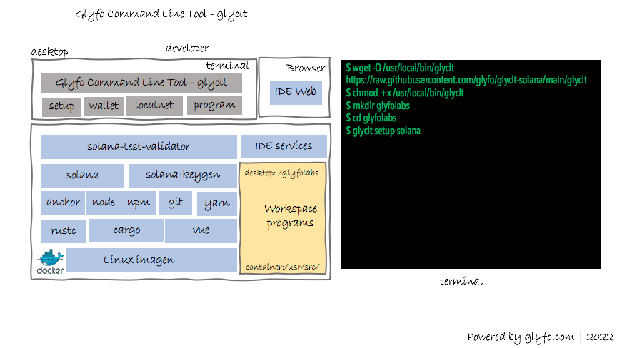

# Command Line Tool.

glyfclt handler communication with solanaX Container. 
The script install tools to support Web3 Development
on Solana Blockchain.

[](https://opensource.org/licenses/Apache-2.0)

## Prerequisite 

+ Docker 
+ wget
+ MacOS ( x86_64 )

## Glyfo Command Line Tool Diagram 



## 1- Install 

```console
$ wget -O /usr/local/bin/glyclt https://github.com/glyfo/glyclt/releases/download/v0.0.1/glyclt
$ chmod +x /usr/local/bin/glyclt
$ glyclt help
...

```
Nota : is Mandatory setup command to build solanaX Container 

## 2- Building solanaX Container 

The solanaX container installed software to support Solana Development. 
The glyfolabs folder is mount point into the container path /usr/src/ .

```console
$ mkdir glyfolabs
$ cd glyfolabs
$ glyclt setup solana 

```
## Solana Fundamentals

+ Everything is an Account
+ Programs are Accounts & Stateless 
+ Data & Program are separate 
+ Program are owners of Acccount created
+ PDA is a Account wihtout signed
+ System Program create Account
+ SPL Program create Token Account 
+ Account pay Storage Use Rent  

## Smart Contract Examples 

+ Comming Soon

## Reference

[Solana Docs] (https://docs.solana.com/)

[Anchor Framework] (https://github.com/project-serum/anchor)

[Anchor Book] (https://book.anchor-lang.com/)

[Docker] (https://docker.com)
